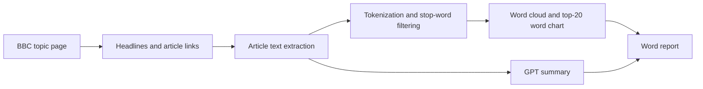

# BBC News Text Analysis and Automated Reporting

A Python coursework project for **MIE1624 at the University of Toronto** that collects BBC reporting on Ukraine, explores word frequencies, and combines visualizations with an AI-generated summary in a Word report.

**Author:** Yunchao (Ven) Chen. Completed with AI assistance for coding and debugging.

## Workflow



## What the project demonstrates

- Web scraping with Requests and BeautifulSoup, including article-body extraction and fallback selectors.
- Text preparation using regular expressions and a custom stop-word list.
- Word-frequency analysis with Counter, Matplotlib, and WordCloud.
- Structured summarization covering topics and humanitarian themes through the OpenAI API.
- Automated report assembly with python-docx.

## Files

- [`Web_scraping_BBC_Ukraine.ipynb`](Web_scraping_BBC_Ukraine.ipynb): complete notebook workflow.
- [`requirements.txt`](requirements.txt): Python dependencies; versions are not pinned.
- [`PREPARATION_NOTES.md`](PREPARATION_NOTES.md): publication changes and validation scope.

## Setup

Use Python 3 in a virtual environment:

```bash
python -m venv .venv
source .venv/bin/activate
pip install -r requirements.txt
jupyter lab Web_scraping_BBC_Ukraine.ipynb
```

On Windows, activate with `.venv\Scripts\activate`.

Set the `OPENAI_API_KEY` environment variable locally **before launching Jupyter** if you want to run the summary and report cells. Never place a real key in the notebook or commit it. The notebook does not automatically read a `.env` file.

Run cells from top to bottom. Scraping and visualization can run without an API key; the final summary/report cells require API access to the configured model (`gpt-4o`). Those cells send the collected text to OpenAI and may incur usage charges.

## Generated outputs

| File | Contents |
| --- | --- |
| `articles_full.txt` | Collected headlines, URLs, and article text |
| `wordcloud_image.png` | Word-frequency visualization |
| `bar_chart.png` | Top 20 filtered words |
| `Article_summary.docx` | Visualizations and generated summary |

The optional short-extraction helper writes `articles.txt`. Generated article text, reports, and original notebook outputs are excluded from version control.

## Scope and limitations

This is a coursework prototype, not a production news-monitoring service. BBC page layouts and CSS class names can change; selectors may require updates. The notebook has no retry policy, deduplication, or large-document chunking. Missing article bodies need review before analysis. It concatenates headlines and article bodies, so repeated headline terms can affect frequencies. The custom stop-word list is a simple baseline, not a linguistic model.

The LLM summary and its reported counts require manual review. Word frequency alone does not measure sentiment, factual accuracy, or humanitarian severity. Results vary with the articles available when the notebook runs.

Code cells were syntax-checked for this publication. Live BBC scraping, paid API calls, and the complete report workflow were not rerun during preparation; the repository does not claim fresh end-to-end validation.

## Acknowledgements

The original notebook states that it was inspired by and builds upon [NewsAutoAnalysisUKR](https://github.com/Op27/NewsAutoAnalysisUKR). That acknowledgement is preserved. BBC is the source of the news content; this repository does not redistribute the scraped article corpus. No affiliation with BBC or the United Nations is claimed.
